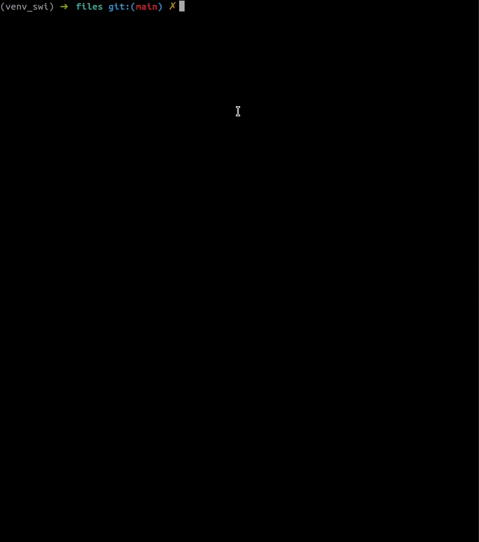

## SWI Lab02 WPA

Auteurs : Jerôme Arn, Gaëtan Daubresse 

### wpa_key_derivation.py

Pour ce script, nous avons écrit des fonctions permettant de récupérer automatiquement les éléments nécessaires à la dérivation de clé depuis une capture wireshark. Nous avons testé le programme uniquement avec le fichier de capture fournit avec le labo. 

### scaircrack.py

Dans ce script nous avons repris le code précédent permettant de récupérer les valeurs nécessaire à la dérivation de clé. Nous lisons ensuite les passphrase d'une wordlist et calculons le MIC sur chacunes de ces passphrase. Si le MIC correspond à celui récuperer dans la 4 eme trame du handshake le scipt affiche alors la passphrase trouvée. 

